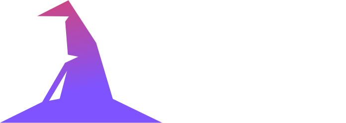

<div align="center">


</div>

<div align="center">
<h1> A Kotlin Symbol Processor that generates data classes for Clean Architecture layers</h1>
</div>

**Clean Wizard is a [`KSP Processor`](https://kotlinlang.org/docs/ksp-overview.html)
that processes annotations and generates data classes for
[`Clean Architecture`](https://blog.cleancoder.com/uncle-bob/2012/08/13/the-clean-architecture.html) layers
using [`Kotlinpoet`](https://square.github.io/kotlinpoet)**.

## Basic Usage

1. **Define your `DTOSchema` that you want to generate classes from and annotate it with `@DTO`**

```kotlin
@DTO
data class ComputerDTOSchema(
    @SerialName("motherboard")
    val motherboard: MotherboardDTOSchema,
    @SerialName("cpu")
    val cpu: CpuDTOSchema,
    @SerialName("isWorking")
    val isWorking: Boolean
)

@DTO
data class MotherboardDTOSchema(
    @SerialName("name")
    val name: String,
)

@DTO
data class CpuDTOSchema(
    @SerialName("name")
    val name: String,
)
```

2. **See the result**

```kotlin
public data class ComputerDTO(
    @SerialName("motherboard")
    public val motherboardDTO: MotherboardDTO,
    @SerialName("cpu")
    public val cpuDTO: CpuDTO,
    @SerialName("isWorking")
    public val isWorking: Boolean,
)

public fun ComputerDTO.toDomain(): ComputerModel = ComputerModel(
    motherboardDTO.toDomain(),
    cpuDTO.toDomain(), isWorking
)

public data class ComputerModel(
    public val motherboardModel: MotherboardModel,
    public val cpuModel: CpuModel,
    public val isWorking: Boolean,
)

public data class ComputerUI(
    public val motherboardUI: MotherboardUI,
    public val cpuUI: CpuUI,
    public val isWorking: Boolean,
)

public fun ComputerModel.toUI(): ComputerUI = ComputerUI(
    motherboardModel.toUI(), cpuModel.toUI(),
    isWorking
)
```

> [!TIP]  
> In case your @SerialName annotation value is the same as field name
> you can just skip adding @SerialName, processor will do it for you, so

```kotlin
@DTO
data class ComputerDTOSchema(
    val motherboard: MotherboardDTOSchema,
    val cpu: CpuDTOSchema,
    val isWorking: Boolean
)

@DTO
data class MotherboardDTOSchema(
    val name: String,
)

@DTO
data class CpuDTOSchema(
    val name: String,
)
```

**will produce the same:**

```kotlin
public data class ComputerDTO(
    @SerialName("motherboard")
    public val motherboardDTO: MotherboardDTO,
    @SerialName("cpu")
    public val cpuDTO: CpuDTO,
    @SerialName("isWorking")
    public val isWorking: Boolean,
)

public fun ComputerDTO.toDomain(): ComputerModel = ComputerModel(
    motherboardDTO.toDomain(),
    cpuDTO.toDomain(), isWorking
)

public data class ComputerModel(
    public val motherboardModel: MotherboardModel,
    public val cpuModel: CpuModel,
    public val isWorking: Boolean,
)

public data class ComputerUI(
    public val motherboardUI: MotherboardUI,
    public val cpuUI: CpuUI,
    public val isWorking: Boolean,
)

public fun ComputerModel.toUI(): ComputerUI = ComputerUI(
    motherboardModel.toUI(), cpuModel.toUI(),
    isWorking
)
```

**Generated classes can be found under build package**:

```
build/
  └── generated/
      └── ksp/
          └── main/
              └── corp/
                  └── tbm/
                      └── cleanarchitecturemapper/
                          ├── computer/
                          │   ├── dto/
                          │   │   └── ComputerDTO.kt
                          │   ├── model/
                          │   │   └── ComputerModel.kt
                          │   └── ui/
                          │       └── ComputerUI.kt
                          ├── motherboard/
                          │   ├── dto/
                          │   │   └── MotherboardDTO.kt
                          │   ├── model/
                          │   │   └── MotherboardModel.kt
                          │   └── ui/
                          │       └── MotherboardUI.kt
                          └── cpu/
                              ├── dto/
                              │   └── CpuDTO.kt
                              ├── model/
                              │   └── CpuModel.kt
                              └── ui/
                                  └── CpuUI.kt
```

**Don't worry, `top-level extension functions to map` are imported!**

```kotlin
import corp.tbm.cleanarchitecturemapper.computer.model.ComputerModel
import corp.tbm.cleanarchitecturemapper.cpu.ui.CpuUI
import corp.tbm.cleanarchitecturemapper.cpu.ui.toUI
import corp.tbm.cleanarchitecturemapper.motherboard.ui.MotherboardUI
import corp.tbm.cleanarchitecturemapper.motherboard.ui.toUI
import kotlin.Boolean

public data class ComputerUI(
    public val motherboardUI: MotherboardUI,
    public val cpuUI: CpuUI,
    public val isWorking: Boolean,
)

public fun ComputerModel.toUI(): ComputerUI = ComputerUI(
    motherboardModel.toUI(), cpuModel.toUI(),
    isWorking
)
```

2. **If you would like to map to domain using some kind of interface, I got you**:

```kotlin
@DTO(toDomainAsTopLevel = true)
data class ComputerDTOSchema(
    val motherboard: MotherboardDTOSchema,
    val cpu: CpuDTOSchema,
    val isWorking: Boolean
)
```

**It will produce the following output:**

```kotlin
public data class ComputerDTO(
    @SerialName("motherboard")
    public val motherboardDTO: MotherboardDTO,
    @SerialName("cpu")
    public val cpuDTO: CpuDTO,
    @SerialName("isWorking")
    public val isWorking: Boolean,
) : DTOMapper<ComputerModel> {
    override fun toDomain(): ComputerModel = ComputerModel(
        motherboardDTO.toDomain(),
        cpuDTO.toDomain(), isWorking
    )
}
```

## Setup 🧩

**Clean Architecture Mapper is available via [Maven Central](https://central.sonatype.com/)**

1. **Add the KSP Plugin**

> **Note**: The KSP version you choose directly depends on the Kotlin version your project utilize </br>
> You can check https://github.com/google/ksp/releases for the list of KSP versions, then select the latest release that
> is compatible with
> your Kotlin version.
> Example:
> If you're using `1.9.22` Kotlin version, then the latest KSP version is `1.9.22-1.0.17`.

<details open>
  <summary>Gradle (Groovy) - build.gradle(:module-name)</summary>

```gradle
plugins {
    id 'com.google.devtools.ksp' version '1.9.22-1.0.17'
}
```

</details>

<details>
  <summary>Gradle (Kotlin)    - build.gradle.kts(:module-name)</summary>  

```gradle
plugins {
    id("com.google.devtools.ksp") version "1.9.22-1.0.17"
}
```

</details>

2. **Add dependencies**

<details open>
  <summary>Gradle (Groovy) - build.gradle(:module-name)</summary>

```gradle
dependencies {
    implementation 'io.github.timbermir:clean-architecture-mapper:1.0.0-snapshot'
    ksp 'io.github.timbermir:clean-architecture-mapper:1.0.0-snapshot'
}
```

</details>

<details>
  <summary>Gradle (Kotlin) - build.gradle.kts(:module-name)</summary>  

```gradle
dependencies {
    implementation("io.github.timbermir:clean-architecture-mapper:1.0.0-snapshot")
    ksp("io.github.timbermir:clean-architecture-mapper:1.0.0-snapshot")
}
```

</details>

## Current Processor limitations 🚧

- **SUPPORTS data class generation only in a single module, in other words you can't generate `DTO`s for `data` module,
  or `Model`s for `domain module`, they are generated in module where `DTOSchema` is located**
- **SUPPORTS only [kotlinx-serialization-json](https://github.com/Kotlin/kotlinx.serialization)**
- **DOES NOT support `enums`, `collections` or any custom type but the source ones**
- **DOES NOT support inheriting other annotations**
- **DOES NOT support inheriting `@SerialName` value if present, generated `@SerialName` value is derived from field's
  name**
- **DOES NOT support backwards mapping, i.e., from `model` to `DTO`**
- **DOES NOT
  support [custom processor options](https://kotlinlang.org/docs/ksp-quickstart.html#pass-options-to-processors),
  i.e.,
  change `DTO` classes suffix to `Dto`**
- **DOES NOT support multiplatform**
- **DOES NOT support [Room](https://developer.android.com/jetpack/androidx/releases/room) entity generation, therefore
  no `TypeConverters` generation**
- **DOES NOT utilize [Incremental processing](https://kotlinlang.org/docs/ksp-incremental.html)**
- **DOES NOT utilize [Multiple round processing](https://kotlinlang.org/docs/ksp-multi-round.html)**

## Building

**It is recommended to use the latest released version of IntelliJ IDEA** (**Community** or **Ultimate Edition**).
You can download
[IntelliJ IDEA](https://www.jetbrains.com/idea/download/) here.

The project **requires JDK 19 to build classes and to run tests**.
**Gradle will try to find it among the installed JDKs** or
**provision it automatically if it couldn't be found**.

For local builds, **you can use an earlier or later version of JDK if you don't have that version installed**.
Specify
the version of this JDK with the ``jdk`` property
in [project-config.versions.toml](gradle/project-config.versions.toml).

After that, you are able to try it out by
running [Main.kt](workload/src/main/kotlin/corp/tbm/cleanarchitecturemapper/workload/Main.kt)

## License

**clean-architecture-mapper** is distributed under the terms of the **Apache License (Version 2.0)**.
See the [license](LICENSE.txt) for more
information.